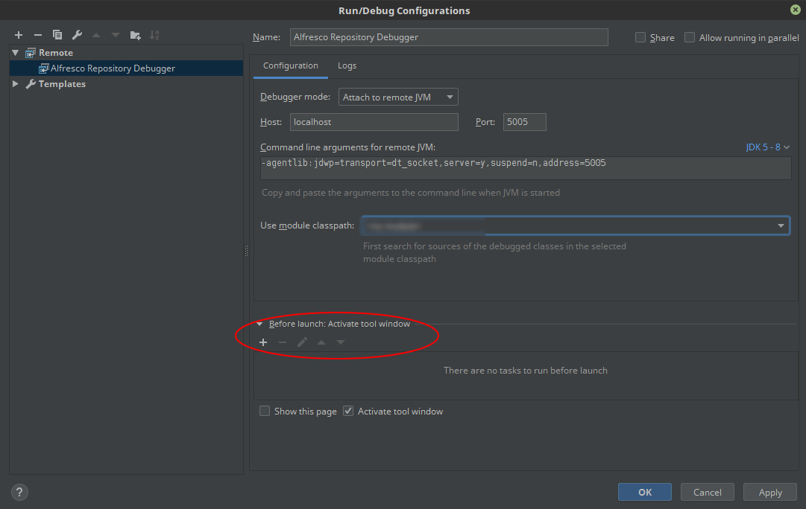
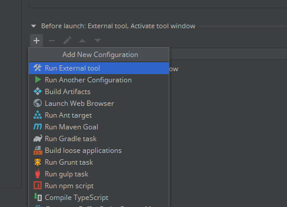
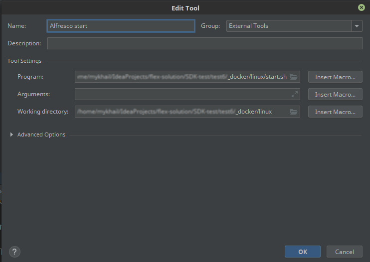
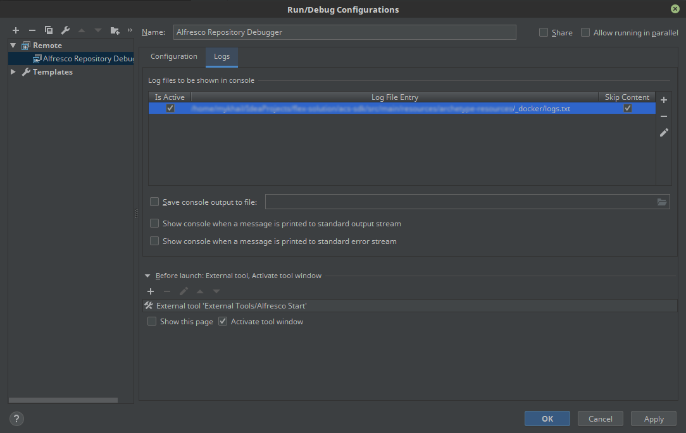

##How to setup environment:
You need to have installed docker and configured to use without root privileges https://docs.docker.com/install

1. Add **Remote** Debugger cofiguration.

1. Configure **Before launch: Tool window** and point at **start.sh** or **start.bat** as executable script.
(files within _docker folder should be executable).

1. Point at **logs.txt** as logs file.

All alfresco configuration placed in **docker-compose.yml**. You can place additional configuration there if you need

To stop docker containers use **stop-all.sh** or **stop-all.bat** script.
**start.sh|bat** script also stops containers and starts again

To debug Share app java code create new **Remote** configuration. Use port 5006