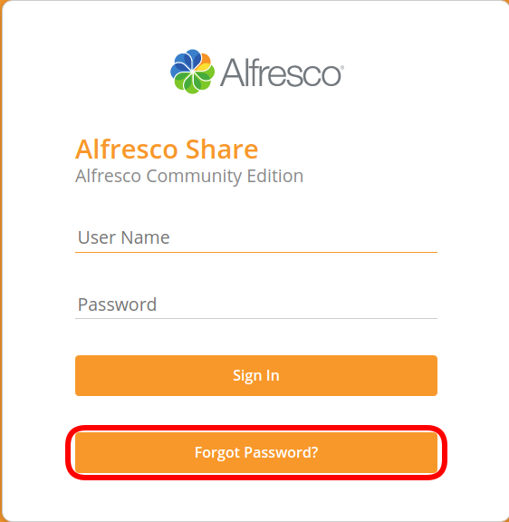
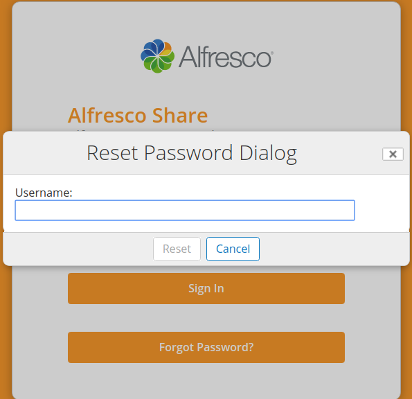
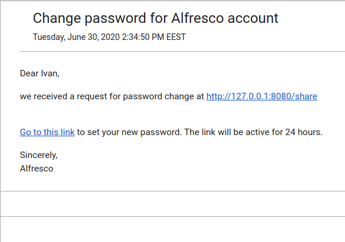

# AlfrescoResetPassword

Alfresco Reset Password add-on is a great thing that allows you to solve missing capability of Alfresco to reset passwords for users who forgot owns password without contacting Administrator.

# Features
 - Sends email notification with a confirmation link
 - Reset password link will be expired after 24h
 - It works fine even if multitenancy feature is enabled

# User's reset password manual

 - Click Forgot Password button
 
 
 
 - Enter username
 
 
 
 - You'll receive email notification with link for changing password
 
 
 
 - Enter your new password and confirm it.
 
 

# Compatibility was tested on versions:
 - Alfresco 5.2
 - Alfresco 6.0.7
 - Alfresco 6.2.0

# How to build
### The following tools must be installed:
- Java8
- Maven3

### Required settings
  - You have to configure Alfresco Outbound SMTP in {ALFRESCO LOCATION}/tomcat/shared/classes/alfresco-global.properties.
  ```sh
   mail.host={mail host}
   mail.port={mail port}
   mail.username={mail username}
   mail.password={mail password}
   mail.protocol=smtps
   mail.smtps.starttls.enable=true
   mail.smtps.auth=true
   mail.from.enabled=false
   mail.from.default={default sending email}
   ```

### Build steps
1. Clone repo
```sh
$ git clone https://github.com/FlexSolution/AlfrescoResetPassword.git
```
2. Compile repo amp 

```sh
$ cd ResetPasswordAddon/resetPassword
$ mvn clean package
```

3. Compile share amp

```sh
$ cd ../resetPassword-share
$ mvn clean package
```

# How to deploy add-on to Alfresco

1. Compile AMPs for alfresco and share how described above
2. Stop Alfresco
3. Copy file ResetPasswordAddon/resetPassword/target/reset-password-repo.amp into ${Alfresco_HOME}/amps folder
4. Copy file ResetPasswordAddon/resetPassword-share/target/reset-password-share.amp into ${Alfresco_HOME}/amps_share folder
5. Apply AMPs by executing command from command line
```sh
$ cd ${Alfresco_HOME}/bin
$ apply_amps.sh -force
```
6. Start Alfresco

